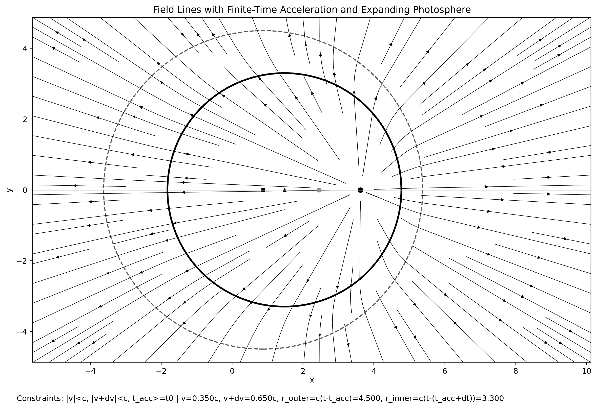

# Radiation Visualiser

Interactive Python studies of how an accelerated charge changes its surrounding electric field.
I built these visualisations to connect spacetime diagrams, causal propagation, and field-line geometry: a finite acceleration does not update space everywhere at once, but produces an expanding transition region between the old and new field states.



The primary visualiser exposes the observation time, initial velocity, velocity change, acceleration duration, and acceleration start time. It shows the charge, its unaccelerated comparison position, and the inner and outer boundaries of the propagating field transition.

## What is included

| File | Purpose |
|---|---|
| `rad.py` | Primary interactive visualiser and command-line snapshot generator. It blends the pre- and post-acceleration uniform-velocity fields across the causal transition region. |
| `bruhemstrahlung.py` | Field-line kink geometry using relativistic angular mapping for a brief acceleration event. |
| `cold.py` | Spacetime diagram of the charge worldline and the light cones emitted at the start and end of acceleration. |
| `pasta.py` | Liénard–Wiechert electric-field study with a numerical retarded-time solve. |
| `rice.py` | Alternate Liénard–Wiechert field study with exact and concentric shell displays. |
| `rad_states.png` | Three-state position diagram used while reasoning about the motion. |
| `rad_notes_diagram.png` | Geometric construction of the expanding radiation shell. |

## Run the main visualiser

Requires Python 3.10 or later.

```bash
python3 -m venv .venv
source .venv/bin/activate
python -m pip install -r requirements.txt
python rad.py
```

The sliders control:

- `t`: observation time.
- `v`: initial velocity as a fraction of `c`.
- `dv`: change in velocity.
- `dt`: acceleration duration.
- `t_acc`: acceleration start time.

Generate a snapshot without opening a window:

```bash
MPLBACKEND=Agg python rad.py \
  --output radiation_visualiser.png \
  --no-show
```

The other scripts are standalone interactive studies. For example:

```bash
python pasta.py
```

## Model

The experiments use units where the speed of light is `c = 1`. The charge follows a prescribed one-dimensional trajectory: uniform motion, a finite interval of constant acceleration, and a new uniform velocity. The resulting two-dimensional plots make three related ideas visible:

- field changes propagate at a finite speed;
- the acceleration interval becomes a shell between two causal fronts;
- retarded time determines which part of the charge trajectory contributes at each observation point.

## Scope

These are exploratory physics visualisations, not a complete Maxwell-equation solver. They use a two-dimensional field slice, idealized motion, normalized units, and singularity cutoffs for plotting. The scripts preserve several related approaches because each exposes a different part of the geometry; they are not presented as interchangeable numerical validation tools.
